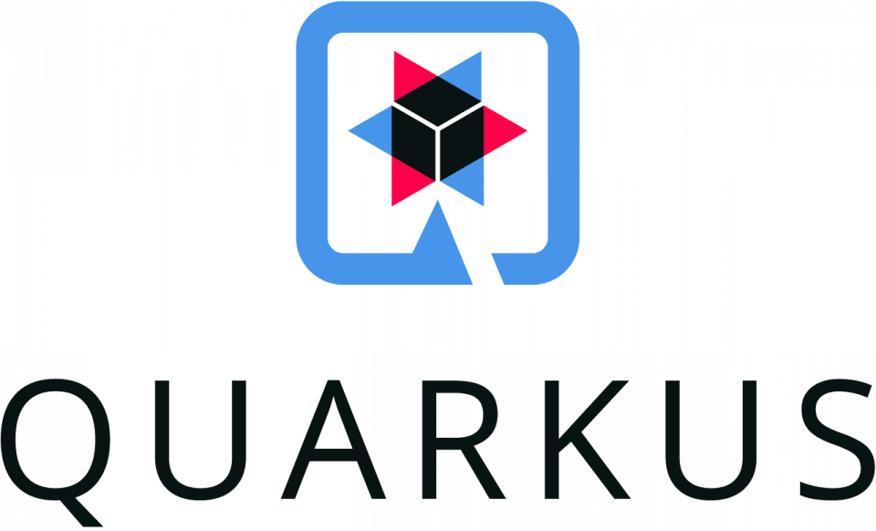
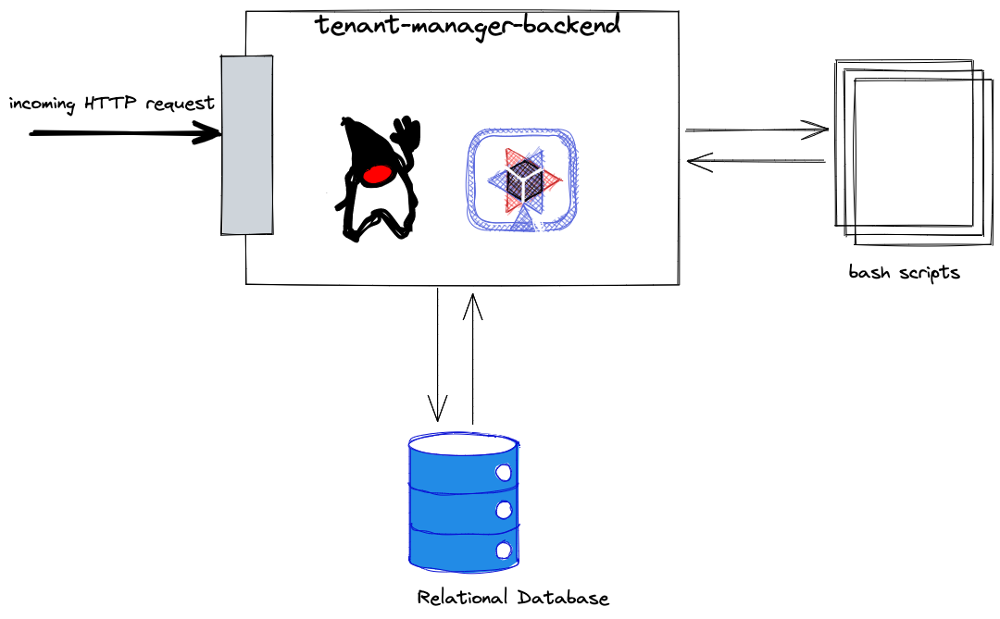

# Tenant Manager Backend 🚀🚀🚀

Backend application that manages the tenant management logics.
This application contains its own relational database to store 
tenant and subscriptions data. 

### Prerequisites
- Install oc-cli
- Up and running Docker environment
- Java 17
- Maven 3.8+

### Overview 🛰️
Mediator application between the frontend and Red Hat Openshift cluster.

