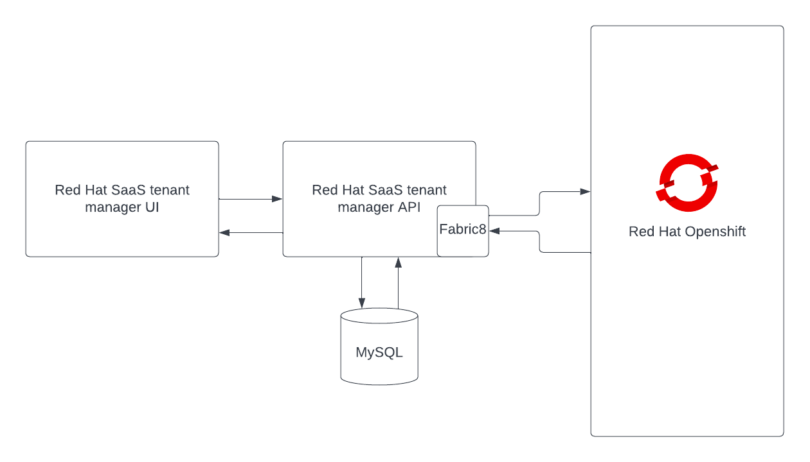

# Red Hat SaaS Tenant Manager Backend

Red Hat SaaS (Software as a Service) reference implementation is a demonstration project to showcase how easy to 
implement a SaaS solution leveraging the Red Hat product portfolio. 

This project contains the basic user interfaces where users can request for an online ecommerce web-shop on demand 
with customizable resource requirements. This project is intend as a reference implementation example for any customer 
who is willing to provide their software solutions to their customer in a tenant based subscriptions.

### Overview

