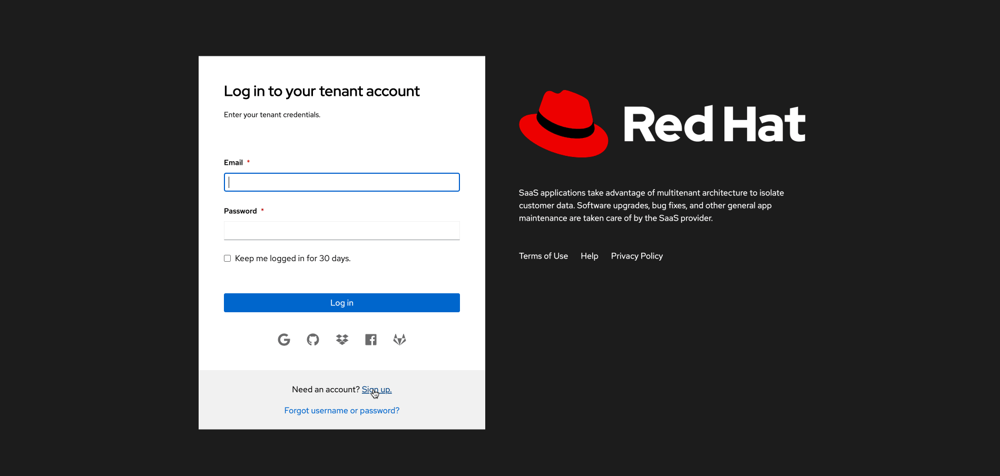

# Red Hat SaaS Tenant Manager Frontend


Red Hat SaaS (Software as a Service) reference implementation is a demonstration project to showcase how easy to 
implement a SaaS solution leveraging the Red Hat product portfolio. 

This project contains the basic user interfaces where users can request for an online ecommerce web-shop on demand 
with customizable resource requirements. This project is intend as a reference implementation example for any customer 
who is willing to provide their software solutions to their customer in a tenant based subscriptions.

### Overview 🛰️

This project only consist the frontend component of this below design. 
Please refer to [this repository](https://github.com/RHEcosystemAppEng/saas-tenant-manager-backend) for the backend component.


### Demo 📺


### How to run 🏃

```shell
git clone https://github.com/RHEcosystemAppEng/saas-tenant-manager-ui.git
cd tenant-manager-ui
npm install
npm run start
```

Application will run in [http://localhost:3000/](http://localhost:3000/)
