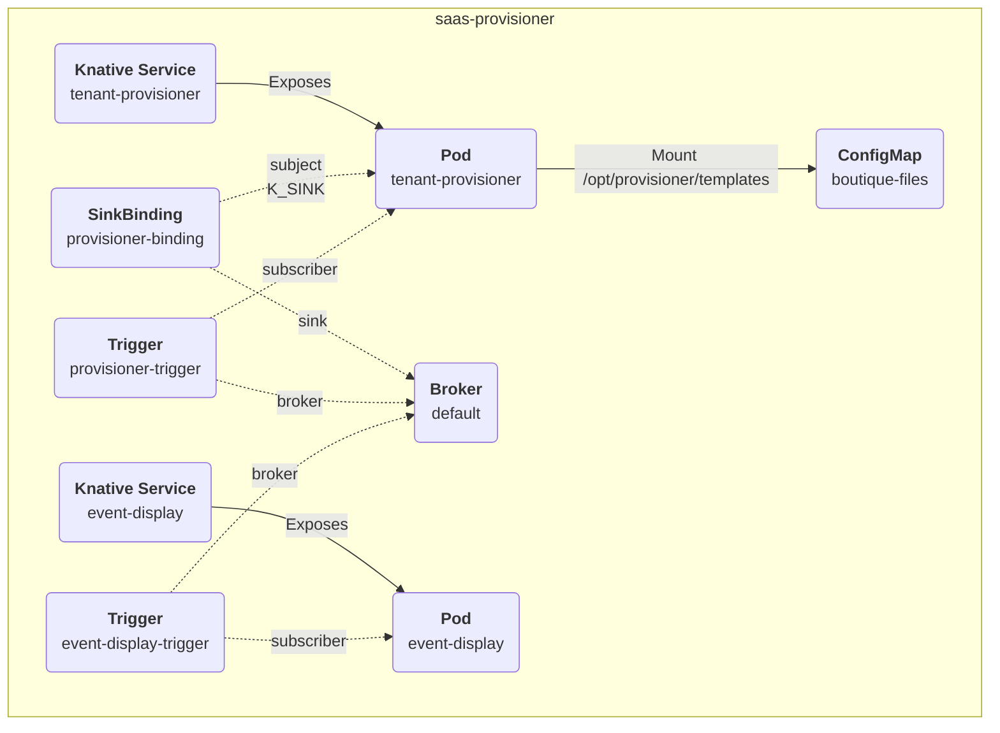

# tenant-provisioner Project
An event-driven Quarkus application to deploy a configurable application for a given tenant.

Designed to run as a Knative service, it's triggered by a Cloud Event with the following specification:
```yaml
Ce-Type: org.acme.saas.provisioner.event.NewTenantRequest
Data:
  {
"tenandId": <any>>,
"tenantName": <any>
}
```

## Application architecture


## Knative deployment
Prerequisites:
* `Red Hat Serverless` operator installed
* `KnativeService` instance configured
* `KnativeEventing` instance configured
* Active login to OpenShift cluster (with `admin` role)
* `quarkus` CLI (can be replaced with `mvn` equivalent)

### Model deployment files in a ConfigMap
```bash
oc create -n saas-provisioner configmap --from-file src/main/resources/boutique_files boutique-files
```
Note: files have been updated to integrate the `${namespace}` variable reaplaced by `FreeMarker` before deploying the application. 
`
### Deploying the application
Run these commands to deploy the application on the `saas-provisioner` namespace;
```bash
oc new-project saas-provisioner
oc apply -f src/main/openshift/eventing.yaml
# TODO replace namespace in subject
oc apply -f src/main/openshift/rbac.yaml
quarkus build \
-Dquarkus.kubernetes.deploy=true \
-Dquarkus.kubernetes.deployment-target=knative \
-Dquarkus.container-image.group=saas-provisioner \
-Dquarkus.container-image.registry=image-registry.openshift-image-registry.svc:5000 \
-Dquarkus.knative.namespace=saas-provisioner \
-Dquarkus.knative.env.vars.PROVISIONER_TEMPLATES_FILES=rbac.yaml,boutique-quota.yaml,all-in-one.yaml,hpa.yaml,route.yaml \
-Dquarkus.knative.config-map-volumes.provisioner-templates.config-map-name=boutique-files \
-Dquarkus.knative.config-map-volumes.provisioner-templates.default-mode=0666 \
-Dquarkus.knative.mounts.provisioner-templates.path=/opt/provisioner/templates \
-Dquarkus.knative.env.vars.PROVISIONER_TEMPLATES_FOLDER=/opt/provisioner/templates
```

The `quarkus` command takes care of generating the deployment files and deploy them on the current cluster.

## Validation
Run this comand to send a trigger Cloud Event that generates a SaaS deployment on the `abc` namespace (will be created if missing):
```bash
export KSVC_URL=$(oc get ksvc tenant-provisioner -n saas-provisioner -ojsonpath='{ .status.url }')
curl -v -k "$KSVC_URL" \
-X POST \
-H "Ce-Id: 1234" \
-H "Ce-Specversion: 1.0" \
-H "Ce-Type: org.acme.saas.provisioner.event.NewTenantRequest" \
-H "Ce-Source: provisioner" \
-H "Content-Type: application/json" \
-d '{
"tenandId":123456,
"tenantName":"abc"
}'
```

Run these commands to log the output of the Pods:
```bash
oc logs -n saas-provisioner -f -l serving.knative.dev/service=event-display -c user-container
oc logs -n saas-provisioner -f -l serving.knative.dev/service=tenant-provisioner -c tenant-provisioner
```
